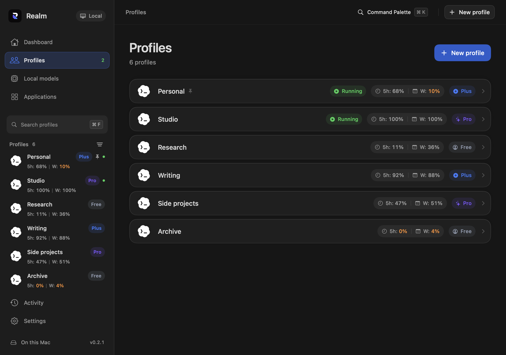
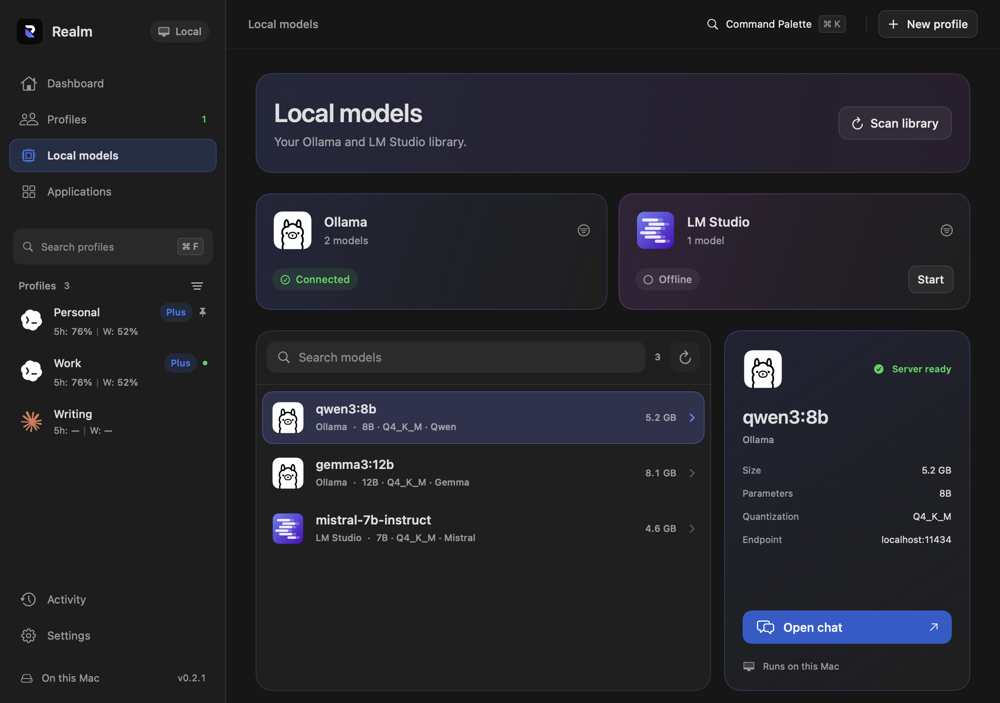

  

<h1 align="center">Realm</h1>

Your accounts. One workspace.

  A native Mac app for Codex, Claude, and your local models.

  <a href="https://github.com/UDPING/Realm/releases/download/v0.2.4/Realm-macOS.dmg"><strong>Download for macOS</strong></a>
  &nbsp; · &nbsp;
  <a href="https://github.com/UDPING/Realm/releases/tag/v0.2.4">What’s new in 0.2.4</a>

Apple silicon · macOS 14 or later

<picture>
  <source media="(prefers-color-scheme: dark)" srcset="docs/screenshots/realm-profiles.png">
  <source media="(prefers-color-scheme: light)" srcset="docs/screenshots/realm-profiles-light.png">
  
</picture>

### A little less switching.

Keep personal and work accounts in named profiles. See what’s running, compare remaining limits, and open the account you need.

- **Limits at a glance.** Five-hour and weekly capacity in the sidebar and profile list. Colored Free, Plus, Pro, and Max badges make accounts easy to recognize.
- **Room to grow.** Profile rows become more compact as your collection grows. Choose Automatic, Comfortable, or Compact density. Open a profile for account details and reset times.
- **Your models, together.** Browse Ollama and LM Studio libraries and chat through their local servers.
- **Made for your Mac.** Light, Dark, or System appearance, an optional translucent sidebar, and subtle transitions. Four accent colors. English, فارسی, and Русский.

### Local models. Familiar tools.

Realm discovers existing model libraries, including GGUF and LM Studio MLX models, without copying the weights. Start a provider, choose a model, and open a chat.

Explore the interface

**Your workspace**

**Applications**

**Make it yours**

Screenshots use sample accounts and usage data. Percentages show remaining capacity. A dash means a limit is unavailable or awaiting a fresh check.

### Get started

1. Download the [macOS installer](https://github.com/UDPING/Realm/releases/download/v0.2.4/Realm-macOS.dmg).
2. Open it and drag **Realm** to **Applications**. Quit an older copy before replacing it.
3. Open Realm, create a Codex or Claude profile, and sign in through that app.

Codex and Claude must be installed separately. Local chat requires Ollama or LM Studio and a downloaded model. Claude limits use the sign-in saved inside that Realm profile. Open the profile and sign in first; if prompted in Realm, choose **Allow access** to authorize the macOS Keychain read.

This build is ad-hoc signed and is not Apple-notarized. macOS may require approval in **System Settings → Privacy & Security** on first launch. [Release notes and checksums](https://github.com/UDPING/Realm/releases/tag/v0.2.4) accompany every download.

### Thoughtfully local

Profile metadata stays in `~/Library/Application Support/Realm/`. Account sessions are separate; supported project and chat data can be shared between profiles. Realm leaves the installed Codex and Claude apps intact.

Account checks use each profile’s own Codex or Claude sign-in. Automatic refresh follows your chosen interval; successful Claude checks are cached for up to five minutes, with backoff if the provider asks you to wait. Local-model chats use your local server. Update checks fetch releases from this repository.

| Action | Shortcut |
| --- | --- |
| New profile | ⌘ N |
| Find a profile | ⌘ F |
| Command palette | ⌘ K |
| Settings | ⌘ , |

---

[Report an issue](https://github.com/UDPING/Realm/issues) · [All releases](https://github.com/UDPING/Realm/releases) · [Earlier Windows build (0.1.0)](https://github.com/UDPING/Realm/releases/tag/v0.1.0)

This repository contains downloads and product documentation. Application source is private. Realm is an independent app and is not affiliated with OpenAI, Anthropic, Ollama, or LM Studio.
