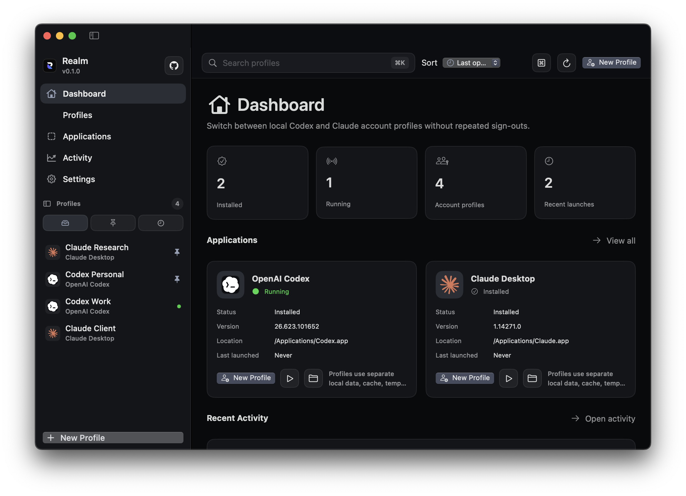
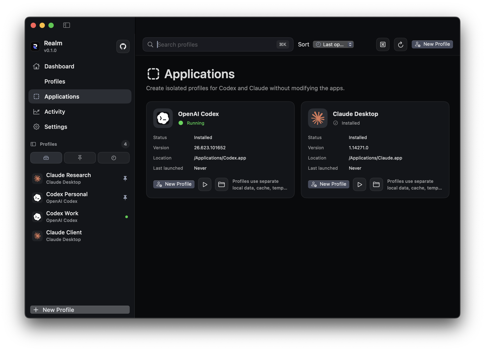
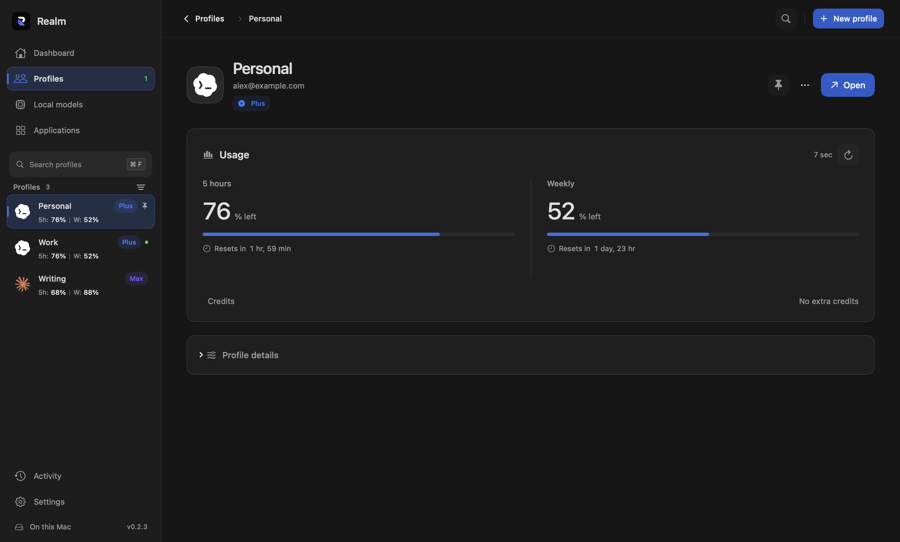
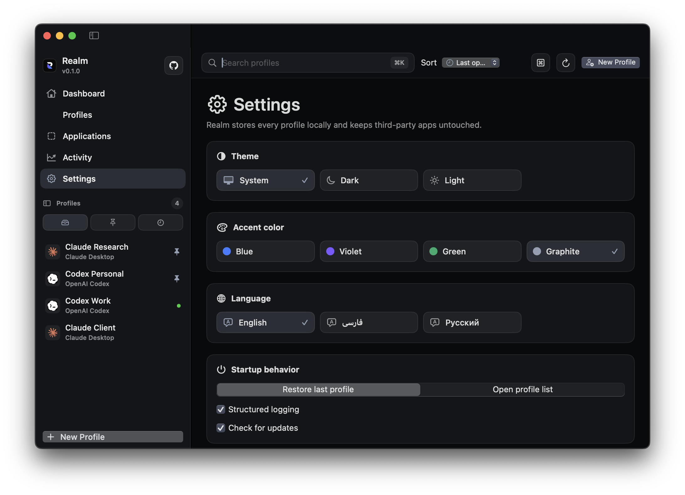
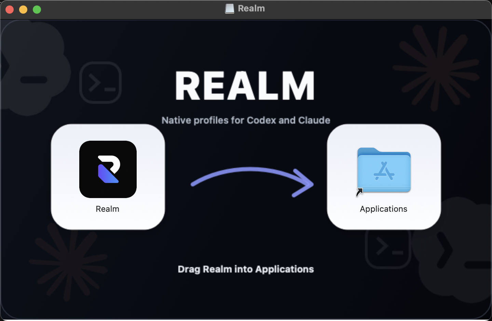

<p align="center">
  
</p>

<h1 align="center">Realm <sub>v0.1.0</sub></h1>

<p align="center">
  A native desktop workspace for keeping Codex and Claude account profiles separate, fast, and local.
</p>

<p align="center">
  <a href="https://github.com/UDPING/Realm">UDPING/Realm</a>
  ·
  <a href="releases/v0.1.0/macOS/Realm-macOS.dmg">macOS DMG</a>
  ·
  <a href="releases/v0.1.0/Windows/Realm-Windows.exe">Windows EXE</a>
</p>

<p align="center">
  
</p>

## Overview

Realm is a native desktop application for macOS and Windows that gives supported AI desktop apps a unified workspace manager. It detects installed apps, creates named profiles for different accounts, launches each profile with separate local data paths, and keeps workspace notes, tags, settings, and activity history in local JSON.

Realm is designed for people who switch between multiple Claude Desktop and OpenAI Codex accounts and do not want repeated sign-out/sign-in cycles. It does not patch, modify, inject into, or replace the supported apps.

## Supported Apps

| App | Status | Profile isolation |
| --- | --- | --- |
| OpenAI Codex | Detect, launch, reveal, running status | Separate home, cache, temp, user-data, logs, and crash roots |
| Claude Desktop | Detect, launch, reveal, running status | Separate user data, cache, temp, logs, and crash roots |

## Screenshots

| Applications | Profile |
| --- | --- |
|  |  |

| Settings | Dashboard |
| --- | --- |
|  |  |

| macOS Installer |
| --- |
|  |

## Features

- Native macOS app built with SwiftUI, Swift 6, Swift Concurrency, Observation, and MVVM.
- Native Windows app built with WinUI 3, Windows App SDK, .NET 9, C#, MVVM Toolkit, and dependency injection.
- Clean Architecture boundaries: Presentation, Application, Domain, Infrastructure, Services, Models, Utilities, and Resources.
- Named account profiles with favorites, recent profiles, search, sort, duplication, deletion, notes, tags, and app association.
- Local JSON persistence with atomic writes, automatic backups, and recovery from the latest valid backup.
- Live application detection for installed, missing, running, version, install location, and last launch state.
- Command palette with keyboard-first profile and app actions.
- Native notifications, menus, context menus, keyboard shortcuts, and accessibility labels.
- Dark-first Codex-inspired interface with a lighter sidebar, darker workspace canvas, native materials, compact profile rows, and clean iconography.
- Settings for theme, accent color, language, startup behavior, workspace directory, logging, and update preferences.
- English, Persian, and Russian interface copy.

## Install

### macOS

Download the macOS installer:

- [Realm-macOS.dmg](releases/v0.1.0/macOS/Realm-macOS.dmg)

Open the DMG, drag `Realm.app` into `Applications`, then launch Realm. The DMG uses a custom Finder layout with a clean installation background.

Checksums:

```text
2dc125805090651449952db03ddbda31e6a61f1d56bd7b2cc52018177897d201  Realm-macOS.dmg
```

### Windows

Download the Windows installer:

- [Realm-Windows.exe](releases/v0.1.0/Windows/Realm-Windows.exe)

Run `Realm-Windows.exe` to install Realm into your local Programs folder and create a Start Menu shortcut. The Windows App SDK runtime is bundled with the app.

Checksum:

```text
0c362cec3352b3044699f8860dab72519d65983f031a5fbb86aaedeab353f06c  Realm-Windows.exe
```

## Local Data

Realm stores all data locally. There is no cloud dependency.

macOS:

```text
~/Library/Application Support/Realm/
~/Library/Logs/Realm/
```

Windows:

```text
%LOCALAPPDATA%\Realm\Data
%LOCALAPPDATA%\Realm\Logs
```

Profile launches use isolated directories under the configured workspace directory. Existing Codex and Claude app bundles are not modified.

## Keyboard Shortcuts

| Action | macOS | Windows |
| --- | --- | --- |
| Command palette | Command+K | Ctrl+K |
| New profile | Command+N | Ctrl+N |
| Search | Command+F | Ctrl+F |
| Settings | Command+, | Ctrl+, |
| Delete profile | Command+Delete | Delete |
| Pin profile | Command+Shift+F | Ctrl+Shift+F |

## Source Availability

The public repository is used for the product README, screenshots, design documentation, and release artifacts. Application source code is private for this release and is not pushed here.

## Architecture

Realm keeps platform UI native while preserving the same product architecture on macOS and Windows.

```text
Presentation    Native views, view models, reusable components, commands
Application     Use cases and orchestration
Domain          Entities, value objects, repository contracts
Infrastructure  JSON persistence, logging, system app detection, launch adapters
Services        Dependency composition and platform services
Models          UI-facing models
Utilities       Focused helpers and formatters
Resources       Assets, localized copy, app icons, design tokens
```

Design and architecture references:

- [Shared design system](Shared/DesignSystem.md)
- [Shared architecture](Shared/Architecture.md)

## Language Notes

### English

Realm keeps each Codex or Claude account in a named local profile so sessions, cache, logs, and workspace notes stay separate.

### فارسی

Realm برای هر حساب Codex یا Claude یک پروفایل محلی جدا می‌سازد تا نشست‌ها، کش، لاگ‌ها و یادداشت‌های کاری با هم تداخل نداشته باشند.

### Русский

Realm создает отдельные локальные профили для аккаунтов Codex и Claude, чтобы сессии, кэш, журналы и заметки рабочих пространств не смешивались.

## Release Policy

The public repository points to release artifacts and documentation. The source is not being pushed as open source in this step.
